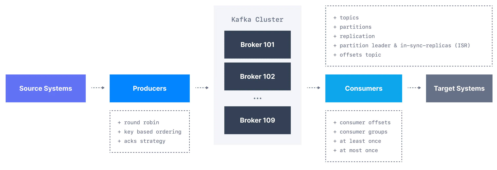
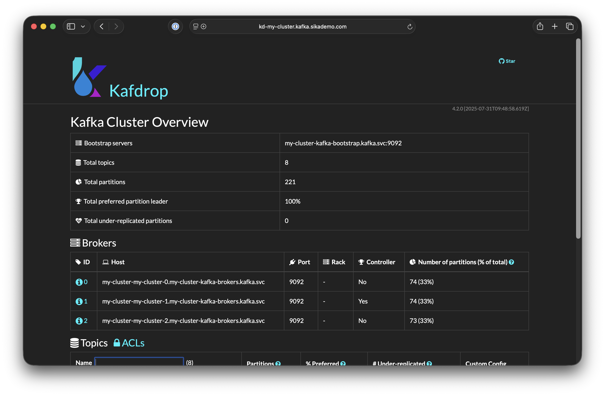
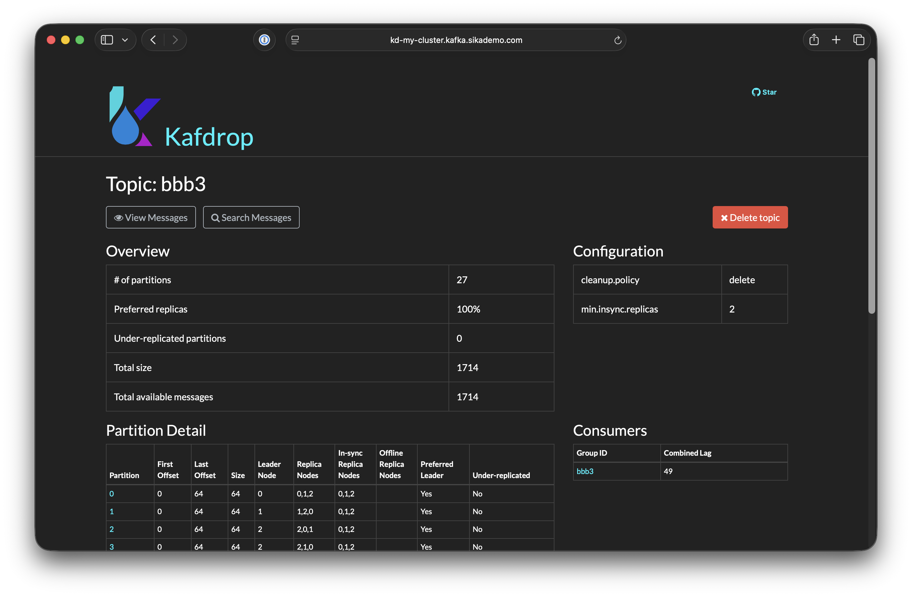

[Ondrej Sika (sika.io)](https://sika.io) | <ondrej@sika.io>

# Kafka Training

### Any Questions?

Write me mail to <ondrej@sika.io>

## Course


## About Me - Ondrej Sika

**Freelance DevOps Engineer, Consultant & Lecturer**

- Complete DevOps Pipeline
- Open Source / Linux Stack
- Cloud & On-Premise
- Technologies: Gitlab CI, Docker, Kubernetes, Terraform, Prometheus, Elastic, AWS, Azure

## Star, Create Issues, Fork, and Contribute

Feel free to star this repository or fork it.

If you found bug, create issue or pull request.

Also feel free to propose improvements by creating issues.

### Chat

For sharing links & "secrets".

- Slack - https://sikapublic.slack.com/
- Microsoft Teams, Google Meet, ...
- https://sika.link/chat (tlk.io)

## DevOps Kniha (Czech only)

[](https://kniha.sika.io)

<https://kniha.sika.io>

## Kafka Theory

### What is Kafka?

- https://docs.conduktor.io/learn/fundamentals/what-is-apache-kafka

Apache Kafka is a **distributed event streaming platform** originally developed at LinkedIn and later open-sourced under the Apache Foundation. It exists to solve the problem of moving large volumes of data reliably and at high throughput between different systems and services in real time — acting as a central, durable message bus where producers publish events to named topics and consumers read them independently at their own pace.


### Kafka Use Cases

- **Event Streaming** — Kafka's core use case; systems emit events (user clicks, transactions, sensor readings) in real time and downstream consumers process them immediately, enabling things like fraud detection, real-time dashboards, or triggering workflows.
- **Messaging** — Kafka replaces traditional message brokers (RabbitMQ, ActiveMQ) for async communication between microservices, with the added benefit of message replay and durability since messages aren't deleted after consumption.
- **Log Aggregation** — All your services ship their logs to Kafka topics, and from there they're forwarded to Elasticsearch, S3, or a data warehouse — centralizing log collection without tight coupling between log producers and storage backends.
- **CDC (Change Data Capture)** — Tools like Debezium tail the database transaction log (e.g. PostgreSQL WAL) and publish every row-level change as a Kafka event, letting other services react to database changes in real time without polling — useful for cache invalidation, search index sync, or replicating data across systems.

### Kafka vs RabbitMQ, ActiveMQ, ...

The core philosophical difference is that traditional message queues like RabbitMQ and ActiveMQ are designed around **message delivery** — a message is pushed to a consumer, acknowledged, and deleted. Kafka is designed around **event log storage** — messages are written to an immutable, ordered log and retained for a configurable period regardless of whether they've been consumed, meaning multiple independent consumers can read the same messages at different offsets and even replay history.

In terms of routing, RabbitMQ offers rich and flexible routing via exchanges, bindings, and routing keys — great for complex delivery logic. Kafka's model is simpler: producers write to topics, consumers read from partitions, and routing logic lives in the application. RabbitMQ also supports per-message TTL, priority queues, and dead-letter exchanges out of the box, making it more feature-rich for classic queueing patterns.

Performance-wise, Kafka wins at scale — it's designed for high-throughput sequential disk I/O and can handle millions of events per second across a cluster, whereas RabbitMQ is better suited for lower-throughput, latency-sensitive scenarios where you need fast per-message acknowledgment. Kafka also scales horizontally by adding partitions and brokers, while RabbitMQ clustering is more complex and has limitations.

### Kafka Core Concepts and Components



**Broker** — A single Kafka server that stores data and serves client requests. A Kafka cluster is made up of multiple brokers for redundancy and scalability; each broker holds some subset of the data.

**Topic** — A named, ordered, append-only log where messages are stored. Think of it like a database table or a log file. Topics are split into **partitions** for parallelism — each partition is an ordered sequence of messages stored on one or more brokers, and messages within a partition have a sequential **offset**.

**Producer** — A client that writes (publishes) messages to a topic. Producers decide which partition to write to — either round-robin, by a specified key (same key always goes to the same partition, guaranteeing order per key), or via custom logic.

**Consumer** — A client that reads messages from a topic by tracking its current offset in each partition. Consumers are grouped into **consumer groups** — within a group, each partition is assigned to exactly one consumer, enabling parallel processing. Multiple independent consumer groups can read the same topic without interfering with each other, which is the key difference from traditional queues.

**Replication** — Each partition has one **leader** broker (handles all reads/writes) and one or more **follower** replicas on other brokers for fault tolerance. If the leader dies, a follower is elected as the new leader automatically.

These five concepts together define Kafka's entire data model — everything else (Kafka Streams, Connect, schema registry) builds on top of them.

### Kafka Topics

- https://docs.conduktor.io/learn/fundamentals/topics


A **topic** is the fundamental unit of organization in Kafka — a named, append-only, ordered log of messages. Here's everything important about topics:

**Partitions** — Every topic is split into one or more partitions, each being an independent ordered log stored on a broker. Partitions are the unit of parallelism: more partitions = more consumers can read in parallel. You set the partition count at topic creation (increasing later is possible but tricky, decreasing is not supported).

**Offsets** — Each message within a partition gets a monotonically increasing integer offset. Consumers track their position by storing the last committed offset, allowing them to resume after restarts or reprocess historical data by resetting the offset.

**Message ordering** — Kafka only guarantees order within a single partition, not across partitions. If you need all messages for a given entity (e.g. a user) to be ordered, use a **message key** — Kafka hashes the key to always route it to the same partition.

**Retention** — Messages aren't deleted after consumption. Retention is configured either by time (`retention.ms`, default 7 days) or by size (`retention.bytes`). After the limit is hit, old segments are deleted.

**Replication factor** — Each partition is replicated across N brokers. A replication factor of 3 is typical in production, meaning the cluster can lose 2 brokers and still serve that partition.

**Topic configuration** — Key settings include `num.partitions`, `replication.factor`, `retention.ms`, `cleanup.policy` (delete vs compact), and `min.insync.replicas` which controls how many replicas must acknowledge a write before it's considered successful.


### Kafka Producers

- https://docs.conduktor.io/learn/fundamentals/producers


A **producer** is a client application that publishes messages to Kafka topics. Key concepts:

**Message structure** — Each message consists of a key (optional), value (the payload), timestamp, and optional headers. Both key and value are raw bytes, so serialization (JSON, Avro, Protobuf) is handled by the producer before sending.

**Partitioning** — The producer decides which partition to send each message to:
- No key → round-robin (or sticky partitioning in newer versions for batching efficiency)
- With key → `hash(key) % num_partitions`, guaranteeing same key always lands in same partition
- Custom partitioner → implement your own logic


**Batching & throughput** — Producers don't send messages one by one; they batch messages destined for the same partition. Two key configs control this: `linger.ms` (how long to wait to fill a batch) and `batch.size` (max batch size in bytes). Higher values = better throughput, higher latency.

**Acknowledgments (`acks`)** — Controls durability vs speed tradeoff:
- `acks=0` — fire and forget, no confirmation
- `acks=1` — leader broker confirms write (default)
- `acks=all` — all in-sync replicas must confirm, strongest durability guarantee

**Retries & idempotency** — Producers retry on transient failures by default. With `enable.idempotence=true` Kafka assigns each producer a PID and sequence numbers, guaranteeing exactly-once delivery to a single partition even if retries occur.

**Compression** — Producers can compress batches with `snappy`, `lz4`, `gzip`, or `zstd` before sending, reducing network and storage overhead significantly.

**Transactions** — Producers can write to multiple partitions atomically using Kafka transactions (`transactional.id`), enabling exactly-once semantics across multiple topics — the foundation of Kafka Streams' exactly-once processing.

### Kafka Message Structure


- **Key** - Key is optional in the Kafka message and it can be null. A key may be a string, number, or any object and then the key is serialized into binary format.
- **Value** - The value represents the content of the message and can also be null. The value format is arbitrary and is then also serialized into binary format.
- **Compression Type** - Kafka messages may be compressed. The compression type can be specified as part of the message. Options are none, gzip, lz4, snappy, and zstd
- **Headers** - There can be a list of optional Kafka message headers in the form of key-value pairs. It is common to add headers to specify metadata about the message, especially for tracing.
- **Partition + Offset** - Once a message is sent into a Kafka topic, it receives a partition number and an offset id. The combination of topic+partition+offset uniquely identifies the message
- **Timestamp** - A timestamp is added either by the user or the system in the message.

### Kafka Consumers

- https://docs.conduktor.io/learn/fundamentals/consumers


A **consumer** is a client application that reads messages from Kafka topics by tracking offsets.

Key concepts:

**Consumer Groups** — Consumers are organized into groups identified by `group.id`. Within a group, each partition is assigned to exactly one consumer — enabling parallel processing. If you have 6 partitions and 3 consumers in a group, each consumer handles 2 partitions. If consumers > partitions, some consumers sit idle. Multiple independent groups can read the same topic simultaneously without interfering — each group maintains its own offset.

**Offset Management** — Consumers track their position via offsets. Offsets are committed back to Kafka (in the internal `__consumer_offsets` topic). Committing can be:
- `enable.auto.commit=true` — commits automatically every `auto.commit.interval.ms` (simple but can cause duplicates or message loss)
- Manual commit — `commitSync()` or `commitAsync()` after processing, giving full control over at-least-once semantics

**Rebalancing** — When a consumer joins or leaves a group, Kafka triggers a **rebalance** to redistribute partitions among active consumers. During rebalancing, consumption is paused. Strategies include `RangeAssignor`, `RoundRobinAssignor`, and `CooperativeStickyAssignor` (minimizes partition movement, preferred in production).

**Delivery Semantics** — Depending on when you commit offsets:
- **At most once** — commit before processing (message lost if crash occurs)
- **At least once** — commit after processing (duplicate processing possible on crash)
- **Exactly once** — requires idempotent producers + transactions or Kafka Streams

**Polling Model** — Kafka consumers use a pull model — the consumer calls `poll()` in a loop to fetch batches of messages. `max.poll.records` controls how many records are returned per poll, and `max.poll.interval.ms` defines how long Kafka waits between polls before considering the consumer dead and triggering a rebalance.

**Lag** — Consumer lag is the difference between the latest offset in a partition and the consumer's current offset — a critical metric indicating how far behind a consumer is. High lag means the consumer can't keep up with the producer throughput.

**Starting Position** — `auto.offset.reset` controls what happens when a consumer group has no committed offset: `earliest` (read from beginning), `latest` (read only new messages), or `none` (throw exception).

### Kafka Brokers

- https://www.conduktor.io/kafka/kafka-brokers


### Kafka Topic Replications

- https://www.conduktor.io/kafka/kafka-topic-replication


## Kafka CLI

## Kaf

Kafka CLI inspired by `kubectl` & `docker` written in Go.

- https://github.com/birdayz/kaf

```
kaf config add-cluster local -b 127.0.0.1:9092
```

```
kaf config use-cluster local
```

or select cluster interactively

```
kaf config select-cluster
```

Test it

```
kaf node ls
```

Set bootstrap node envrironment variable

```
export BOOTSTRAP_SERVER=127.0.0.1:9092
```

### List Topics

```
kafka-topics.sh --bootstrap-server $BOOTSTRAP_SERVER --list
```

```
kaf topics
```

### Create Topic

```
kafka-topics.sh --bootstrap-server $BOOTSTRAP_SERVER --create --topic k-0-t-0 --partitions 3 --replication-factor 1
```

```
kaf topic create k-0-t-0 -p 3 -r 1
```

### Describe Topic

```
kafka-topics.sh --bootstrap-server $BOOTSTRAP_SERVER --describe --topic k-0-t-0
```

```
kaf topic describe k-0-t-0
```

### Delete Topic

```
kafka-topics.sh --bootstrap-server $BOOTSTRAP_SERVER --delete --topic k-0-t-0
```

```
kaf topic delete k-0-t-0
```

## Console Producer

```
kafka-console-producer.sh --bootstrap-server $BOOTSTRAP_SERVER --topic foo
```

```
kaf produce foo
```

## Console Consumer

```
kafka-console-consumer.sh --bootstrap-server $BOOTSTRAP_SERVER --topic foo
```

```
kaf consume foo
```

```
kaf consume foo -f
```

## Terminal UI for Kafka

# Kaskade (Python)

- https://github.com/sauljabin/kaskade

Install using Brew

```
brew install kaskade
```

Using pipx

```
pipx install kaskade
```

Run

```
kaskade admin -b 127.0.0.1:9092
```

## Kafdrop (simple web UI)

- https://kafdrop.com/
- https://github.com/obsidiandynamics/kafdrop





### Install Kafdrop on Kubernetes

```
helm upgrade --install \
  kafdrop \
  --namespace kafdrop \
  --create-namespace \
  --repo https://helm.sikalabs.io \
  simple-kafdrop \
  --set host=kd-my-cluster.kafka.sikademo.com \
  --set kafkaBootstrapServer=my-cluster-kafka-bootstrap.kafka.svc:9092 \
  --wait
```

### Install Kafdrop on OpenShift

```
helm upgrade --install \
  kafdrop \
  --namespace kafdrop \
  --create-namespace \
  --repo https://helm.sikalabs.io \
  simple-kafdrop \
  --set host=kd-egd.apps.egd.germanywestcentral.aroapp.io \
  --set kafkaBootstrapServer=egd-kafka-bootstrap.kafka.svc:9092 \
  --set tls=false \
  --set ingressClassName=openshift-default \
  --set ingressExtraAnnotations."route\.openshift\.io/termination"=edge \
  --set ingressExtraAnnotations."route\.openshift\.io/insecureEdgeTerminationPolicy"=Redirect \
  --wait
```

## Apache Kafka vs Confluent Kafka

**Apache Kafka** is the open-source project maintained by the Apache Software Foundation. **Confluent Kafka** is a commercial platform built on top of Apache Kafka by the original creators of Kafka (from LinkedIn).

### Core Kafka Engine

Both use the same underlying Kafka broker. Confluent Kafka *is* Apache Kafka at its core — Confluent contributes heavily to the open-source project and ships the same broker.

### Key Differences

**Schema Registry**
Apache Kafka has no built-in schema management. Confluent provides Schema Registry (Avro, JSON Schema, Protobuf) — though the open-source version is now available separately too.

**Connectors (Kafka Connect)**
Kafka Connect is open-source, but Confluent offers 200+ pre-built, certified connectors via Confluent Hub, plus a managed connector experience in Confluent Cloud.

**ksqlDB / Kafka Streams**
Stream processing with Kafka Streams is open-source. ksqlDB (SQL over Kafka) was created by Confluent — the core is open-source but some enterprise features are behind a paywall.

**Control Center**
Confluent's UI for monitoring, consumer lag, topic management, and schema browsing. Nothing comparable exists in vanilla Kafka (you'd use open-source tools like AKHQ, Redpanda Console, or Kafdrop).

**Security & RBAC**
Basic security (SSL, SASL) is in open-source Kafka. Fine-grained RBAC is a Confluent Enterprise feature.

**Support & SLA**
Apache Kafka = community support. Confluent = commercial support with SLAs.

## Confluent License Change (important!)

In 2023, Confluent moved some components from Apache 2.0 to the **Confluent Community License** and **Confluent Server** (proprietary). This means you can't use certain Confluent components to build a competing managed Kafka service, but for most enterprise users this doesn't matter.

## When to choose what

**Choose Apache Kafka** when you want full open-source freedom, are comfortable assembling your own tooling stack (AKHQ, Kafdrop, custom monitoring), and want to avoid vendor lock-in.

**Choose Confluent** when you want a batteries-included platform, need enterprise support, want managed cloud with minimal ops overhead, or need Schema Registry and Connect Hub out of the box.

## Othler Kafka Alternatives / Distributions

- **Redpanda** (Kafka-compatible, no JVM)
- **MSK** (AWS managed Kafka)
- **Azure Event Hubs** (Kafka protocol compatible)

## Kafka Bridge

Kafka Bridge is a component that provides a REST API interface to Apache Kafka, allowing HTTP-based clients to interact with Kafka without needing a native Kafka client.

It acts as a proxy between HTTP clients and the Kafka cluster, translating RESTful requests into Kafka producer and consumer operations. This is particularly useful for applications that cannot use Kafka's native protocol or for integrating with systems that primarily communicate over HTTP.

## Strimzi

> Kafka on Kubernetes in a few minutes

- https://strimzi.io/
- https://strimzi.io/quickstarts/

## Install Strimzi

```
kubectl create namespace kafka
```

```
kubectl create -f 'https://strimzi.io/install/latest?namespace=kafka' -n kafka
```

See all Strimzi API resources (CRDs)

```
kubectl api-resources | grep strimzi.io
```

See operator's pod:

```
kubectl get pod -n kafka
```

or watch

```
watch -n 0.3 kubectl get pod -n kafka
```

## Create Kafka Cluster using Strimzi

Apply:

```
kubectl apply -f examples/strimzi/kafka-1.yml
```

See pods:

```
kubectl get kafka,pod -n kafka
```

or watch

```
watch -n 0.3 kubectl get kafka,pod -n kafka
```

Get kafkas

```
kubectl get kafka
```

```
kubectl get k
```

Get Bootstrap servers

```
kubectl describe -f examples/strimzi/kafka-1.yml | grep "Bootstrap Servers"
```

Create topic

```
kubectl apply -f examples/strimzi/kafka-1-topic-1.yml
```

Get topic

```
kubectl get -f examples/strimzi/kafka-1-topic-1.yml
```

Watch topic

```
watch -n 0.3 kubectl get -f examples/strimzi/kafka-1-topic-1.yml
```

## Large HA Kafka Cluster

- 3 Zookeepers
- 3 Brokers with 4 disks

```
kubectl apply -f examples/strimzi/kafka-3.yml
```

## Kafka Auth Example

```
kubectl apply -f examples/strimzi/kafka-4.yml
```

```
kubectl apply -f examples/strimzi/kafka-4-topic-0.yml
kubectl apply -f examples/strimzi/kafka-4-topic-1.yml
```

```
kubectl apply -f examples/strimzi/kafka-4-user-0.yml
kubectl apply -f examples/strimzi/kafka-4-user-1.yml
```

```
kubectl get k,kt,ku
```

```
kubectl describe secret k-4-u-0
```

## Thank you! & Questions?

That's it. Do you have any questions? **Let's go for a beer!**

### Ondrej Sika

- email: <ondrej@sika.io>
- web: <https://sika.io>
- twitter: [@ondrejsika](https://twitter.com/ondrejsika)
- linkedin: [/in/ondrejsika/](https://linkedin.com/in/ondrejsika/)
- Newsletter, Slack, Facebook & Linkedin Groups: <https://join.sika.io>

_Do you like the course? Write me recommendation on Twitter (with handle `@ondrejsika`) and LinkedIn (add me [/in/ondrejsika](https://www.linkedin.com/in/ondrejsika/) and I'll send you request for recommendation). **Thanks**._

Wanna to go for a beer or do some work together? Just [book me](https://book-me.sika.io) :)
