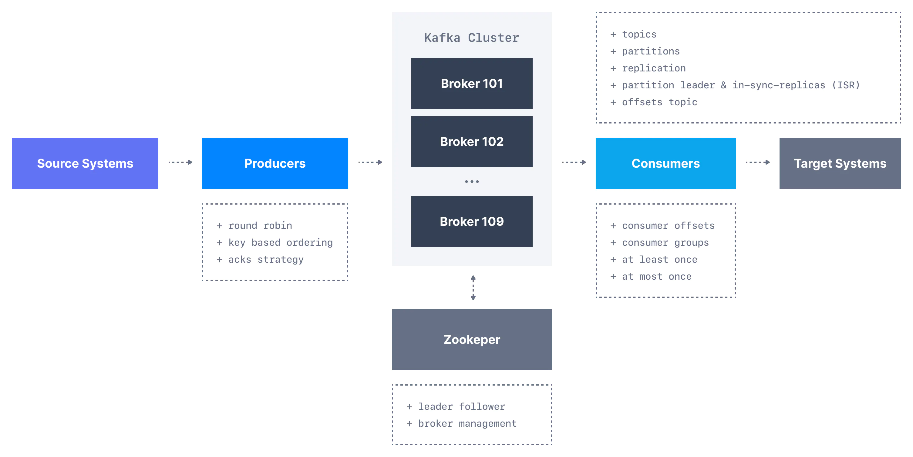
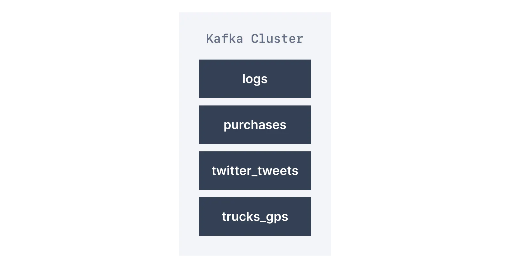
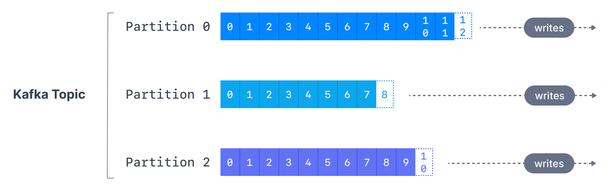
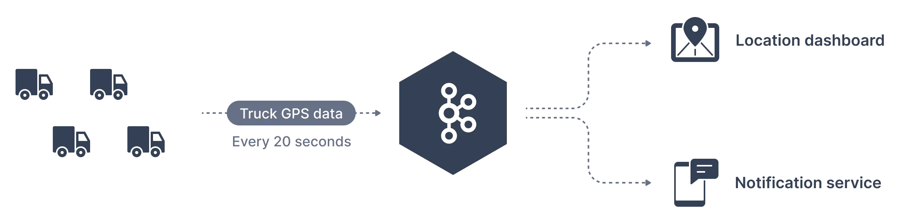
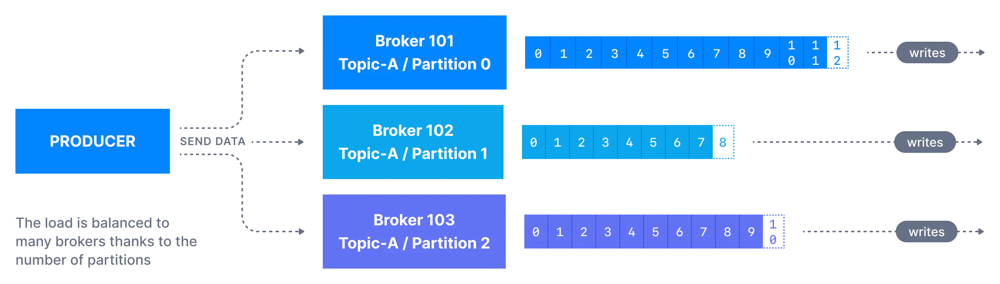
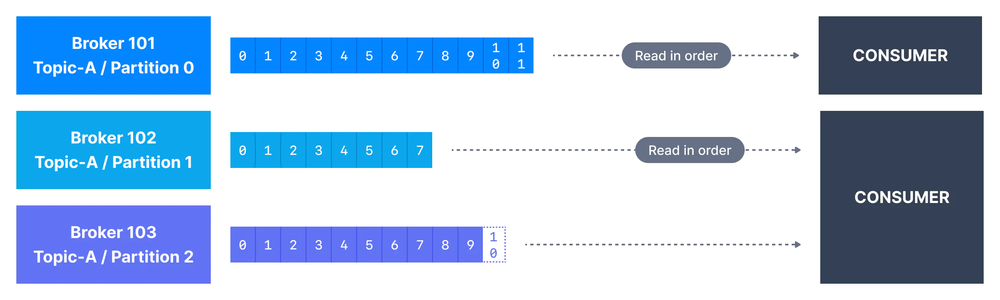
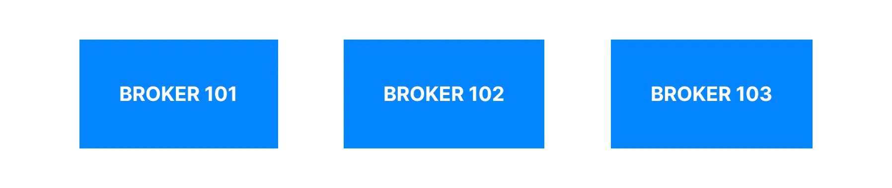
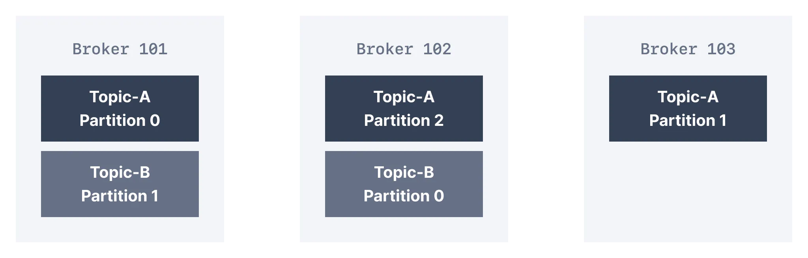
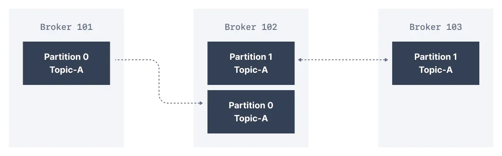

[Ondrej Sika (sika.io)](https://sika.io) | <ondrej@sika.io>

# Kafka Training

### Any Questions?

Write me mail to <ondrej@sika.io>

## Course

## About Me - Ondrej Sika

**Freelance DevOps Engineer, Consultant & Lecturer**

- Complete DevOps Pipeline
- Open Source / Linux Stack
- Cloud & On-Premise
- Technologies: Gitlab CI, Docker, Kubernetes, Terraform, Prometheus, Elastic, AWS, Azure

## Star, Create Issues, Fork, and Contribute

Feel free to star this repository or fork it.

If you found bug, create issue or pull request.

Also feel free to propose improvements by creating issues.

### Chat

For sharing links & "secrets".

- Slack - https://sikapublic.slack.com/
- Microsoft Teams, Google Meet, ...
- https://sika.link/chat (tlk.io)

## DevOps Kniha (Czech only)

[](https://kniha.sika.io)

<https://kniha.sika.io>

## Kafka Theoretical Introduction

### Kafka Components

- https://www.conduktor.io/kafka/kafka-fundamentals



### Kafka Topics

- https://www.conduktor.io/kafka/kafka-topics







### Kafka Producers

- https://www.conduktor.io/kafka/kafka-producers



### Kafka Consumers

- https://www.conduktor.io/kafka/kafka-consumers



### Kafka Brokers

- https://www.conduktor.io/kafka/kafka-brokers





### Kafka Topic Replications

- https://www.conduktor.io/kafka/kafka-topic-replication



## Kafka CLI

## Kaf

Kafka CLI inspired by `kubectl` & `docker` written in Go.

- https://github.com/birdayz/kaf

```
kaf config add-cluster local -b 127.0.0.1:9092
```

```
kaf config select-cluster
```

Test it

```
kaf node ls
```

Set bootstrap node envrironment variable

```
export BOOTSTRAP_SERVER=127.0.0.1:9092
```

### List Topics

```
kafka-topics.sh --bootstrap-server $BOOTSTRAP_SERVER --list
```

```
kaf topics
```

### Create Topic

```
kafka-topics.sh --bootstrap-server $BOOTSTRAP_SERVER --create --topic k-0-t-0 --partitions 3 --replication-factor 1
```

```
kaf topic create k-0-t-0 -p 3 -r 1
```

### Describe Topic

```
kafka-topics.sh --bootstrap-server $BOOTSTRAP_SERVER --describe --topic k-0-t-0
```

```
kaf topic describe k-0-t-0
```

### Delete Topic

```
kafka-topics.sh --bootstrap-server $BOOTSTRAP_SERVER --delete --topic k-0-t-0
```

```
kaf topic delete k-0-t-0
```

## Console Producer

```
kafka-console-producer.sh --bootstrap-server $BOOTSTRAP_SERVER --topic foo
```

```
kaf produce foo
```

## Console Consumer

```
kafka-console-consumer.sh --bootstrap-server $BOOTSTRAP_SERVER --topic foo
```

```
kaf consume foo
```

```
kaf consume foo -f
```

## Strimzi

> Kafka on Kubernetes in a few minutes

- https://strimzi.io/
- https://strimzi.io/quickstarts/

## Install Strimzi

```
kubectl create namespace kafka
```

```
kubectl create -f 'https://strimzi.io/install/latest?namespace=kafka' -n kafka
```

See all Strimzi API resources (CRDs)

```
kubectl api-resources | grep strimzi.io
```

See operator's pod:

```
kubectl get pod -n kafka
```

or watch

```
watch -n 0.3 kubectl get pod -n kafka
```

## Create Kafka Cluster using Strimzi

Apply:

```
kubectl apply -f examples/strimzi/kafka-1.yml
```

See pods:

```
kubectl get kafka,pod -n kafka
```

or watch

```
watch -n 0.3 kubectl get kafka,pod -n kafka
```

Get kafkas

```
kubectl get kafka
```

```
kubectl get k
```

Get Bootstrap servers

```
kubectl describe k kafka-1 | grep "Bootstrap Servers"
```

Create topic

```
kubectl apply -f examples/strimzi/kafka-1-topic-1.yml
```

Get topic

```
kubectl get -f examples/strimzi/kafka-1-topic-1.yml
```

Watch topic

```
watch -n 0.3 kubectl get -f examples/strimzi/kafka-1-topic-1.yml
```

## Thank you! & Questions?

That's it. Do you have any questions? **Let's go for a beer!**

### Ondrej Sika

- email: <ondrej@sika.io>
- web: <https://sika.io>
- twitter: [@ondrejsika](https://twitter.com/ondrejsika)
- linkedin: [/in/ondrejsika/](https://linkedin.com/in/ondrejsika/)
- Newsletter, Slack, Facebook & Linkedin Groups: <https://join.sika.io>

_Do you like the course? Write me recommendation on Twitter (with handle `@ondrejsika`) and LinkedIn (add me [/in/ondrejsika](https://www.linkedin.com/in/ondrejsika/) and I'll send you request for recommendation). **Thanks**._

Wanna to go for a beer or do some work together? Just [book me](https://book-me.sika.io) :)
