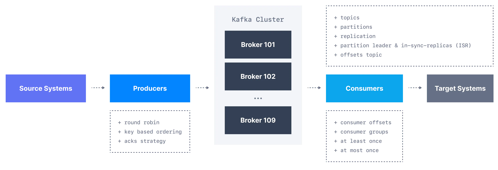
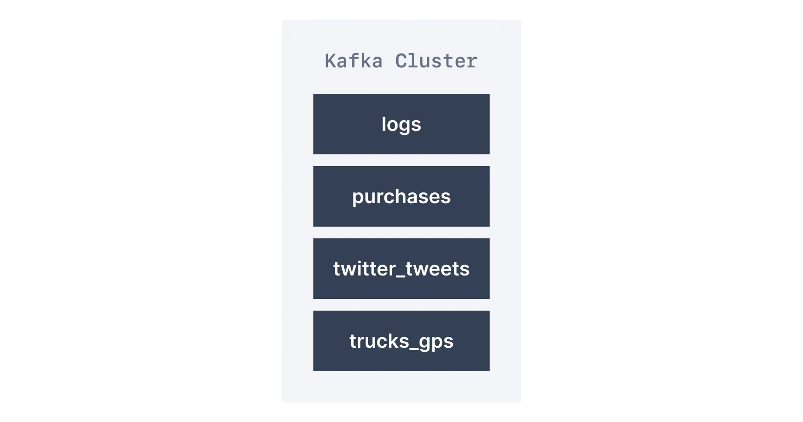
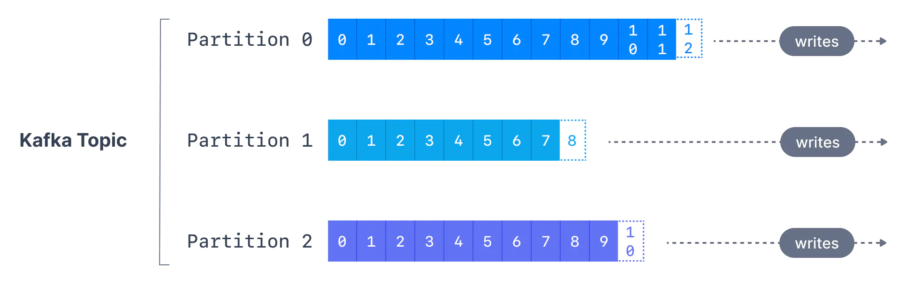
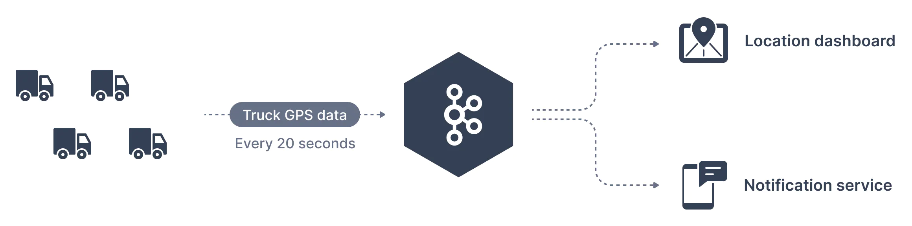
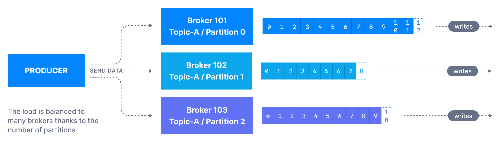
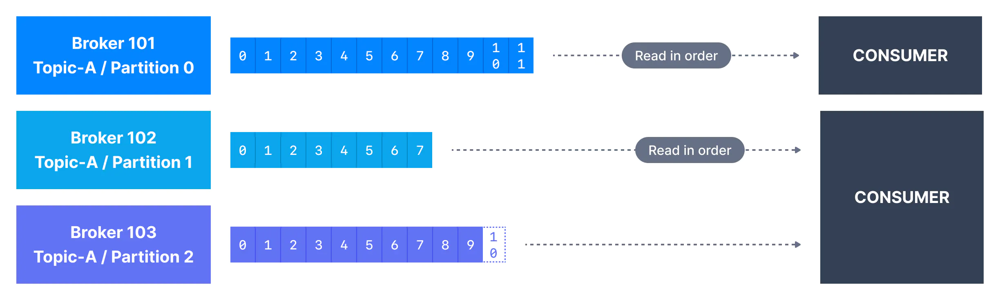
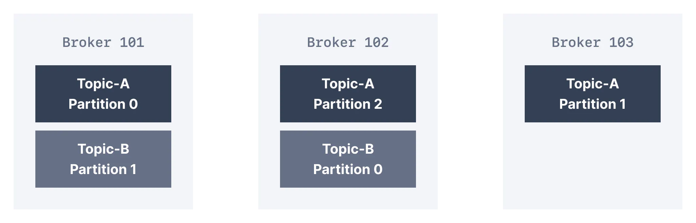
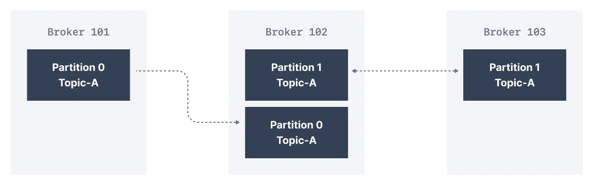
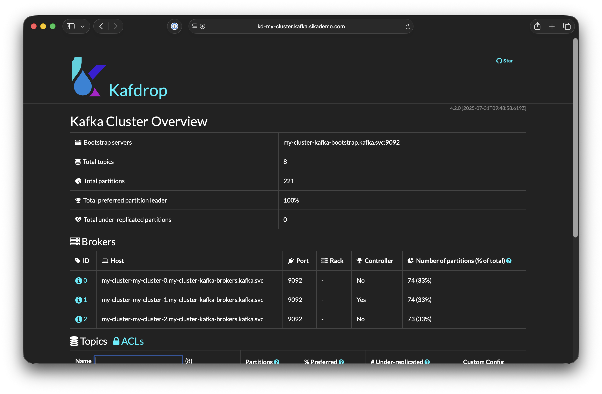
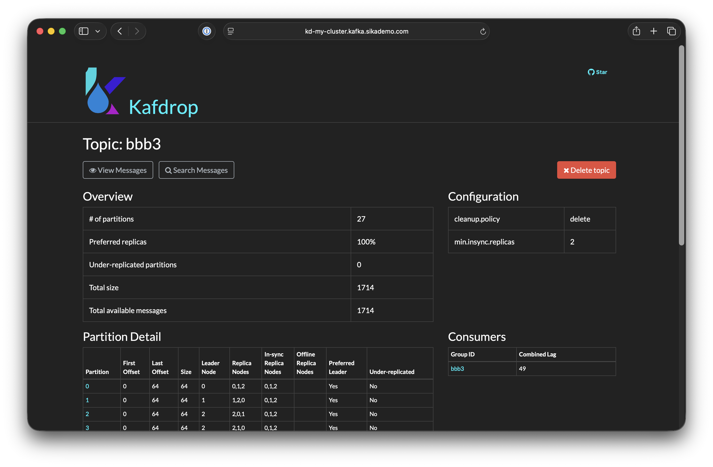

[Ondrej Sika (sika.io)](https://sika.io) | <ondrej@sika.io>

# Kafka Training

### Any Questions?

Write me mail to <ondrej@sika.io>

## Course


## About Me - Ondrej Sika

**Freelance DevOps Engineer, Consultant & Lecturer**

- Complete DevOps Pipeline
- Open Source / Linux Stack
- Cloud & On-Premise
- Technologies: Gitlab CI, Docker, Kubernetes, Terraform, Prometheus, Elastic, AWS, Azure

## Star, Create Issues, Fork, and Contribute

Feel free to star this repository or fork it.

If you found bug, create issue or pull request.

Also feel free to propose improvements by creating issues.

### Chat

For sharing links & "secrets".

- Slack - https://sikapublic.slack.com/
- Microsoft Teams, Google Meet, ...
- https://sika.link/chat (tlk.io)

<!--

## DevOps Kniha (Czech only)

[](https://kniha.sika.io)

<https://kniha.sika.io>

-->

## Kafka Theory

### What is Kafka?

- https://docs.conduktor.io/learn/fundamentals/what-is-apache-kafka

Apache Kafka is a **distributed event streaming platform** originally developed at LinkedIn and later open-sourced under the Apache Foundation. It exists to solve the problem of moving large volumes of data reliably and at high throughput between different systems and services in real time — acting as a central, durable message bus where producers publish events to named topics and consumers read them independently at their own pace.


### Kafka Use Cases

- **Event Streaming** — Kafka's core use case; systems emit events (user clicks, transactions, sensor readings) in real time and downstream consumers process them immediately, enabling things like fraud detection, real-time dashboards, or triggering workflows.
- **Messaging** — Kafka replaces traditional message brokers (RabbitMQ, ActiveMQ) for async communication between microservices, with the added benefit of message replay and durability since messages aren't deleted after consumption.
- **Log Aggregation** — All your services ship their logs to Kafka topics, and from there they're forwarded to Elasticsearch, S3, or a data warehouse — centralizing log collection without tight coupling between log producers and storage backends.
- **CDC (Change Data Capture)** — Tools like Debezium tail the database transaction log (e.g. PostgreSQL WAL) and publish every row-level change as a Kafka event, letting other services react to database changes in real time without polling — useful for cache invalidation, search index sync, or replicating data across systems.

### Kafka vs RabbitMQ, ActiveMQ, ...

The core philosophical difference is that traditional message queues like RabbitMQ and ActiveMQ are designed around **message delivery** — a message is pushed to a consumer, acknowledged, and deleted. Kafka is designed around **event log storage** — messages are written to an immutable, ordered log and retained for a configurable period regardless of whether they've been consumed, meaning multiple independent consumers can read the same messages at different offsets and even replay history.

In terms of routing, RabbitMQ offers rich and flexible routing via exchanges, bindings, and routing keys — great for complex delivery logic. Kafka's model is simpler: producers write to topics, consumers read from partitions, and routing logic lives in the application. RabbitMQ also supports per-message TTL, priority queues, and dead-letter exchanges out of the box, making it more feature-rich for classic queueing patterns.

Performance-wise, Kafka wins at scale — it's designed for high-throughput sequential disk I/O and can handle millions of events per second across a cluster, whereas RabbitMQ is better suited for lower-throughput, latency-sensitive scenarios where you need fast per-message acknowledgment. Kafka also scales horizontally by adding partitions and brokers, while RabbitMQ clustering is more complex and has limitations.

### Kafka Core Concepts and Components



**Broker** — A single Kafka server that stores data and serves client requests. A Kafka cluster is made up of multiple brokers for redundancy and scalability; each broker holds some subset of the data.

**Topic** — A named, ordered, append-only log where messages are stored. Think of it like a database table or a log file. Topics are split into **partitions** for parallelism — each partition is an ordered sequence of messages stored on one or more brokers, and messages within a partition have a sequential **offset**.

**Producer** — A client that writes (publishes) messages to a topic. Producers decide which partition to write to — either round-robin, by a specified key (same key always goes to the same partition, guaranteeing order per key), or via custom logic.

**Consumer** — A client that reads messages from a topic by tracking its current offset in each partition. Consumers are grouped into **consumer groups** — within a group, each partition is assigned to exactly one consumer, enabling parallel processing. Multiple independent consumer groups can read the same topic without interfering with each other, which is the key difference from traditional queues.

**Replication** — Each partition has one **leader** broker (handles all reads/writes) and one or more **follower** replicas on other brokers for fault tolerance. If the leader dies, a follower is elected as the new leader automatically.

These five concepts together define Kafka's entire data model — everything else (Kafka Streams, Connect, schema registry) builds on top of them.

### Kafka Topics

- https://docs.conduktor.io/learn/fundamentals/topics


A **topic** is the fundamental unit of organization in Kafka — a named, append-only, ordered log of messages. Here's everything important about topics:

**Partitions** — Every topic is split into one or more partitions, each being an independent ordered log stored on a broker. Partitions are the unit of parallelism: more partitions = more consumers can read in parallel. You set the partition count at topic creation (increasing later is possible but tricky, decreasing is not supported).

**Offsets** — Each message within a partition gets a monotonically increasing integer offset. Consumers track their position by storing the last committed offset, allowing them to resume after restarts or reprocess historical data by resetting the offset.

**Message ordering** — Kafka only guarantees order within a single partition, not across partitions. If you need all messages for a given entity (e.g. a user) to be ordered, use a **message key** — Kafka hashes the key to always route it to the same partition.

**Retention** — Messages aren't deleted after consumption. Retention is configured either by time (`retention.ms`, default 7 days) or by size (`retention.bytes`). After the limit is hit, old segments are deleted.

**Replication factor** — Each partition is replicated across N brokers. A replication factor of 3 is typical in production, meaning the cluster can lose 2 brokers and still serve that partition.

**Topic configuration** — Key settings include `num.partitions`, `replication.factor`, `retention.ms`, `cleanup.policy` (delete vs compact), and `min.insync.replicas` which controls how many replicas must acknowledge a write before it's considered successful.







### Kafka Producers

- https://docs.conduktor.io/learn/fundamentals/producers



A **producer** is a client application that publishes messages to Kafka topics. Key concepts:

**Message structure** — Each message consists of a key (optional), value (the payload), timestamp, and optional headers. Both key and value are raw bytes, so serialization (JSON, Avro, Protobuf) is handled by the producer before sending.

**Partitioning** — The producer decides which partition to send each message to:
- No key → round-robin (or sticky partitioning in newer versions for batching efficiency)
- With key → `hash(key) % num_partitions`, guaranteeing same key always lands in same partition
- Custom partitioner → implement your own logic


**Batching & throughput** — Producers don't send messages one by one; they batch messages destined for the same partition. Two key configs control this: `linger.ms` (how long to wait to fill a batch) and `batch.size` (max batch size in bytes). Higher values = better throughput, higher latency.

**Acknowledgments (`acks`)** — Controls durability vs speed tradeoff:
- `acks=0` — fire and forget, no confirmation
- `acks=1` — leader broker confirms write (default)
- `acks=all` — all in-sync replicas must confirm, strongest durability guarantee

**Retries & idempotency** — Producers retry on transient failures by default. With `enable.idempotence=true` Kafka assigns each producer a PID and sequence numbers, guaranteeing exactly-once delivery to a single partition even if retries occur.

**Compression** — Producers can compress batches with `snappy`, `lz4`, `gzip`, or `zstd` before sending, reducing network and storage overhead significantly.

**Transactions** — Producers can write to multiple partitions atomically using Kafka transactions (`transactional.id`), enabling exactly-once semantics across multiple topics — the foundation of Kafka Streams' exactly-once processing.

### Kafka Message Structure


- **Key** - Key is optional in the Kafka message and it can be null. A key may be a string, number, or any object and then the key is serialized into binary format.
- **Value** - The value represents the content of the message and can also be null. The value format is arbitrary and is then also serialized into binary format.
- **Compression Type** - Kafka messages may be compressed. The compression type can be specified as part of the message. Options are none, gzip, lz4, snappy, and zstd
- **Headers** - There can be a list of optional Kafka message headers in the form of key-value pairs. It is common to add headers to specify metadata about the message, especially for tracing.
- **Partition + Offset** - Once a message is sent into a Kafka topic, it receives a partition number and an offset id. The combination of topic+partition+offset uniquely identifies the message
- **Timestamp** - A timestamp is added either by the user or the system in the message.

### Kafka Consumers

- https://docs.conduktor.io/learn/fundamentals/consumers



A **consumer** is a client application that reads messages from Kafka topics by tracking offsets.

Key concepts:

**Consumer Groups** — Consumers are organized into groups identified by `group.id`. Within a group, each partition is assigned to exactly one consumer — enabling parallel processing. If you have 6 partitions and 3 consumers in a group, each consumer handles 2 partitions. If consumers > partitions, some consumers sit idle. Multiple independent groups can read the same topic simultaneously without interfering — each group maintains its own offset.

**Offset Management** — Consumers track their position via offsets. Offsets are committed back to Kafka (in the internal `__consumer_offsets` topic). Committing can be:
- `enable.auto.commit=true` — commits automatically every `auto.commit.interval.ms` (simple but can cause duplicates or message loss)
- Manual commit — `commitSync()` or `commitAsync()` after processing, giving full control over at-least-once semantics

**Rebalancing** — When a consumer joins or leaves a group, Kafka triggers a **rebalance** to redistribute partitions among active consumers. During rebalancing, consumption is paused. Strategies include `RangeAssignor`, `RoundRobinAssignor`, and `CooperativeStickyAssignor` (minimizes partition movement, preferred in production).

**Delivery Semantics** — Depending on when you commit offsets:
- **At most once** — commit before processing (message lost if crash occurs)
- **At least once** — commit after processing (duplicate processing possible on crash)
- **Exactly once** — requires idempotent producers + transactions or Kafka Streams

**Polling Model** — Kafka consumers use a pull model — the consumer calls `poll()` in a loop to fetch batches of messages. `max.poll.records` controls how many records are returned per poll, and `max.poll.interval.ms` defines how long Kafka waits between polls before considering the consumer dead and triggering a rebalance.

**Lag** — Consumer lag is the difference between the latest offset in a partition and the consumer's current offset — a critical metric indicating how far behind a consumer is. High lag means the consumer can't keep up with the producer throughput.

**Starting Position** — `auto.offset.reset` controls what happens when a consumer group has no committed offset: `earliest` (read from beginning), `latest` (read only new messages), or `none` (throw exception).

### Kafka Brokers

- https://www.conduktor.io/kafka/kafka-brokers

A **broker** is a single Kafka server process identified by a unique integer ID. Multiple brokers form a cluster, and partitions are distributed across them — so both data and request load are spread horizontally. Adding more brokers increases storage capacity and throughput without downtime.




### Kafka Node Types

Since Kafka 3.3, Kafka runs in **KRaft mode** — ZooKeeper is gone and cluster metadata is managed by Kafka itself using the Raft consensus protocol. Each broker process is assigned one or more **roles** that define what it does in the cluster.

**Roles:**

**Controller** — manages cluster metadata: topic creation/deletion, partition leadership elections, broker membership. In KRaft, controllers form a quorum (typically 3) and elect a leader among themselves using Raft. They don't serve producer/consumer traffic.

**Broker** — stores data and serves client requests (produce, fetch, consumer group coordination). This is the data plane.

**Combined (controller + broker)** — a single process that acts as both. Simple to operate, fine for small clusters and development.

**Topologies:**

```
# Combined — all nodes do everything (small clusters, dev)
node-0: controller + broker
node-1: controller + broker
node-2: controller + broker

# Dedicated — separated roles (large production clusters)
node-0: controller only  ┐
node-1: controller only  ├─ quorum (3 controllers)
node-2: controller only  ┘
node-3: broker only  ┐
node-4: broker only  ├─ data plane (scale independently)
node-5: broker only  ┘
```

**When to use dedicated controllers:**

- Large clusters (10+ brokers) where controller load could impact broker performance
- When you want to scale brokers independently without touching the controller quorum
- High-throughput clusters where partition leadership elections under load matter

**In Strimzi**, roles are set in the `KafkaNodePool` resource:

```yaml
# Combined
spec:
  roles:
    - controller
    - broker

# Dedicated controllers
spec:
  roles:
    - controller

# Dedicated brokers
spec:
  roles:
    - broker
```

A cluster can have multiple node pools — one pool for controllers and another for brokers — allowing independent scaling and different storage/resource configs per role.

### Kafka Topic Replications

- https://www.conduktor.io/kafka/kafka-topic-replication

Replication keeps copies of each partition on multiple brokers to ensure durability. Each partition has exactly one **leader** (which handles all reads and writes) and one or more **followers** that replicate the leader's data. The subset of followers that are fully caught up forms the **ISR** (In-Sync Replicas) — if the leader fails, Kafka automatically elects a new leader from the ISR with no data loss.



### Kafka Security

- **authentication**: who is connecting?
- **authorization**: what are they allowed to do?

#### Kafka Authentication

**SASL/PLAIN** — Username and password sent in cleartext. Simple to configure, but must always be combined with TLS encryption in production to avoid credential leakage.

**SASL/SCRAM-SHA-256 and SCRAM-SHA-512** — Challenge-response mechanism; credentials are salted and hashed so the password is never transmitted directly. Credentials are stored in KRaft metadata. The preferred SASL option for most deployments that don't require Kerberos.

**SASL/GSSAPI (Kerberos)** — Integrates with an existing Kerberos infrastructure (MIT Kerberos or Active Directory). Common in large enterprises with a centralized identity provider, but operationally heavy.

**SASL/OAUTHBEARER** — Clients present a JWT token issued by an external OAuth 2.0 / OIDC provider (e.g. Keycloak, Okta). Good fit for cloud-native environments where identity is already centralized in an IdP.

**mTLS (Mutual TLS)** — Both the broker and the client present X.509 certificates; the client is identified by the certificate's Distinguished Name (DN). Zero shared secrets, strong identity, but requires a PKI to manage certificate lifecycle.

#### Kafka Authorization

**ACLs (Access Control Lists)** — Kafka's built-in authorization model. Rules specify which principal can perform which operation (`Read`, `Write`, `Create`, `Describe`, `Delete`, `Alter`, `DescribeConfigs`, `AlterConfigs`) on which resource (topic, consumer group, cluster). Managed via `kafka-acls.sh` or the Admin API, and stored in KRaft metadata.

**RBAC** — Role-based access control available in Confluent Enterprise and some other distributions. Assigns permissions via roles rather than per-resource ACL entries — simpler to manage at scale.

### Kafka Listeners

A **listener** is a network endpoint on which a Kafka broker accepts connections. Brokers can expose multiple listeners simultaneously — for example one for internal cluster traffic and one for external clients — each with its own protocol and port.

**Two key broker configs:**

- `listeners` — the address the broker actually binds to (what the OS listens on)
- `advertised.listeners` — the address the broker tells clients to connect to (what clients use after discovery)

These differ when the broker is behind a load balancer, NAT, or Kubernetes service — the broker binds on a private address but advertises a public one.

**Listener protocols:**

| Protocol | Transport | Authentication |
|---|---|---|
| `PLAINTEXT` | no TLS | none |
| `SSL` | TLS | mTLS (optional) |
| `SASL_PLAINTEXT` | no TLS | SASL (PLAIN, SCRAM, GSSAPI, OAUTHBEARER) |
| `SASL_SSL` | TLS | SASL |

**Typical multi-listener setup:**

```properties
listeners=INTERNAL://0.0.0.0:9092,EXTERNAL://0.0.0.0:9094
advertised.listeners=INTERNAL://broker-1.kafka.svc:9092,EXTERNAL://kafka.example.com:9094
listener.security.protocol.map=INTERNAL:SASL_PLAINTEXT,EXTERNAL:SASL_SSL
inter.broker.listener.name=INTERNAL
```

- `INTERNAL` — used for broker-to-broker replication and in-cluster clients; SASL without TLS is acceptable on a private network
- `EXTERNAL` — used by clients outside the cluster; always use TLS here
- `inter.broker.listener.name` — tells Kafka which listener to use for replication between brokers

**In Strimzi (Kubernetes)**, listeners are defined in the `Kafka` CR and Strimzi generates the broker config automatically:

```yaml
listeners:
  - name: plain
    port: 9092
    type: internal
    tls: false
  - name: tls
    port: 9093
    type: internal
    tls: true
  - name: lb
    port: 9094
    type: loadbalancer
    tls: true
```

Each listener type (`internal`, `loadbalancer`, `nodeport`, `ingress`, `route`) results in a different Kubernetes service and a different advertised address — Strimzi handles the advertised.listeners wiring for you.

### Kafka Cluster Parameters (Strimzi)

In Strimzi, cluster configuration is split across two resources:

- **`Kafka` CR** — broker-level Kafka params go under `spec.kafka.config`
- **`KafkaNodePool` CR** — storage, replicas, roles, and compute resources go here

Strimzi manages several params automatically and will **reject** any attempt to set them manually in `spec.kafka.config`: `log.dirs`, `listeners`, `advertised.listeners`, `broker.id`, `node.id`, `controller.quorum.voters`, `inter.broker.listener.name`. Configure these via the dedicated CR fields instead.

#### Retention & Cleanup (`spec.kafka.config`)

| Parameter | Default | Description |
|---|---|---|
| `log.retention.ms` | `604800000` (7 days) | How long to keep messages before deletion. Set to `-1` for unlimited. Overrides `log.retention.hours`. |
| `log.retention.bytes` | `-1` (unlimited) | Max size of a single partition before old segments are deleted. `-1` disables size-based deletion. |
| `log.segment.bytes` | `1073741824` (1 GB) | Max size of a single log segment file. Smaller = faster cleanup cycles. |
| `log.cleanup.policy` | `delete` | `delete` — remove old segments by time/size; `compact` — keep only the latest value per key; `delete,compact` — both. |

#### Replication & Durability (`spec.kafka.config`)

| Parameter | Default | Description |
|---|---|---|
| `default.replication.factor` | `1` | Default replication factor for auto-created topics. Set to `3` in production. |
| `min.insync.replicas` | `1` | Minimum ISR replicas that must acknowledge a write when `acks=all`. Set to `2` in production (tolerates one broker failure). |
| `offsets.topic.replication.factor` | `3` | Replication factor for the internal `__consumer_offsets` topic. Must be ≤ number of brokers. |
| `transaction.state.log.replication.factor` | `3` | Replication factor for the internal transaction log topic. |
| `transaction.state.log.min.isr` | `2` | Min ISR for the transaction log — set to the same value as `min.insync.replicas`. |
| `unclean.leader.election.enable` | `false` | If `true`, allows an out-of-sync replica to become leader (risks data loss). Keep `false` in production. |

#### Topic Defaults (`spec.kafka.config`)

| Parameter | Default | Description |
|---|---|---|
| `num.partitions` | `1` | Default partition count for auto-created topics. |
| `auto.create.topics.enable` | `true` | Allow producers to auto-create topics. Disable in production to prevent topic sprawl. |
| `delete.topic.enable` | `true` | Allow topic deletion via the Admin API. |
| `message.max.bytes` | `1048588` (~1 MB) | Max size of a message the broker accepts. If raised, also increase `replica.fetch.max.bytes` and consumer `fetch.max.bytes`. |
| `compression.type` | `producer` | Broker-side compression. `producer` preserves the producer's compression. `lz4`/`snappy`/`zstd` re-compresses on the broker. |

#### Performance & I/O (`spec.kafka.config`)

| Parameter | Default | Description |
|---|---|---|
| `num.network.threads` | `3` | Threads handling network requests. Rule of thumb: ~3× number of CPU cores. |
| `num.io.threads` | `8` | Threads for disk I/O. Rule of thumb: 1 per disk, minimum 8. |
| `replica.fetch.max.bytes` | `1048576` (1 MB) | Max bytes fetched per partition during broker-to-broker replication. Must be ≥ `message.max.bytes`. |
| `socket.send.buffer.bytes` | `102400` | TCP send buffer. Set to `-1` to use the OS default. |
| `socket.receive.buffer.bytes` | `102400` | TCP receive buffer. Set to `-1` to use the OS default. |

#### Storage (`KafkaNodePool.spec.storage`)

Storage is defined in the `KafkaNodePool`, not in the `Kafka` CR. Strimzi supports JBOD — multiple persistent volumes per node for better I/O parallelism.

**JBOD (Just a Bunch of Disks)** means Kafka uses multiple independent disks directly, without combining them into RAID or a logical volume. Kafka gets a separate `log.dir` path for each volume and spreads partitions across all of them automatically.

Why JBOD over a single large volume:
- Each disk does its own I/O independently — no single disk is a bottleneck
- If one disk fails, only the partitions on that disk are affected; the rest keep working
- Easy to add capacity by adding more volumes to the pool

```yaml
# Single disk — all partitions on one PVC (dev / simple setups)
storage:
  type: persistent-claim
  size: 300Gi
  kraftMetadata: shared
```

```yaml
# JBOD — 3 disks, partitions spread across all three (production)
storage:
  type: jbod
  volumes:
    - id: 0
      type: persistent-claim
      size: 1Gi
      kraftMetadata: shared  # KRaft metadata goes here
    - id: 1
      type: persistent-claim
      size: 100Gi
    - id: 2
      type: persistent-claim
      size: 100Gi
```

Both examples have similar total capacity, but JBOD gives you parallel I/O across all disks. On Kubernetes each volume becomes a separate PVC backed by a separate physical/cloud volume (EBS, GCP PD, etc.).

| Field | Description |
|---|---|
| `type: jbod` | Multiple volumes per node, each becomes an independent log directory. |
| `type: persistent-claim` | Single persistent volume per node. |
| `size` | PVC size (e.g. `10Gi`, `100Gi`). |
| `deleteClaim` | Whether to delete the PVC when the node is removed. `false` is safer in production. |
| `kraftMetadata: shared` | Which volume stores KRaft metadata. Required on exactly one volume per node when using combined controller+broker roles. |

#### Example: Development (single node)

```yaml
apiVersion: kafka.strimzi.io/v1
kind: Kafka
metadata:
  name: my-dev
  namespace: kafka
spec:
  kafka:
    version: 4.2.0
    metadataVersion: 4.2-IV1
    listeners:
      - name: plain
        port: 9092
        type: internal
        tls: false
    config:
      offsets.topic.replication.factor: 1
      transaction.state.log.replication.factor: 1
      transaction.state.log.min.isr: 1
      default.replication.factor: 1
      min.insync.replicas: 1
      log.retention.hours: 24
      auto.create.topics.enable: "true"
  entityOperator:
    topicOperator: {}
    userOperator: {}
---
apiVersion: kafka.strimzi.io/v1
kind: KafkaNodePool
metadata:
  name: my-dev
  namespace: kafka
  labels:
    strimzi.io/cluster: my-dev
spec:
  replicas: 1
  roles:
    - controller
    - broker
  storage:
    type: jbod
    volumes:
      - id: 0
        type: persistent-claim
        size: 10Gi
        deleteClaim: true
        kraftMetadata: shared
```

#### Example: Production cluster (3 nodes, JBOD)

```yaml
apiVersion: kafka.strimzi.io/v1
kind: Kafka
metadata:
  name: my-prod
  namespace: kafka
spec:
  kafka:
    version: 4.2.0
    metadataVersion: 4.2-IV1
    listeners:
      - name: plain
        port: 9092
        type: internal
        tls: false
      - name: tls
        port: 9093
        type: internal
        tls: true
    config:
      default.replication.factor: 3
      min.insync.replicas: 2
      offsets.topic.replication.factor: 3
      transaction.state.log.replication.factor: 3
      transaction.state.log.min.isr: 2
      log.retention.hours: 168
      log.retention.bytes: -1
      log.segment.bytes: 1073741824
      unclean.leader.election.enable: "false"
      auto.create.topics.enable: "false"
      message.max.bytes: 10485760
      replica.fetch.max.bytes: 10485760
      num.network.threads: 6
      num.io.threads: 16
      compression.type: producer
  entityOperator:
    topicOperator: {}
    userOperator: {}
---
apiVersion: kafka.strimzi.io/v1
kind: KafkaNodePool
metadata:
  name: my-prod
  namespace: kafka
  labels:
    strimzi.io/cluster: my-prod
spec:
  replicas: 3
  roles:
    - controller
    - broker
  storage:
    type: jbod
    volumes:
      - id: 0
        type: persistent-claim
        size: 1Gi
        deleteClaim: false
        kraftMetadata: shared
      - id: 1
        type: persistent-claim
        size: 100Gi
        deleteClaim: false
      - id: 2
        type: persistent-claim
        size: 100Gi
        deleteClaim: false
      - id: 3
        type: persistent-claim
        size: 100Gi
        deleteClaim: false
  resources:
    requests:
      memory: 4Gi
      cpu: "2"
    limits:
      memory: 8Gi
      cpu: "4"
```

## Run Single Node Kafka in Docker

```
docker run -d --name kafka \
  -p 9092:9092 \
  -e KAFKA_NODE_ID=1 \
  -e KAFKA_PROCESS_ROLES=broker,controller \
  -e KAFKA_LISTENERS=PLAINTEXT://0.0.0.0:9092,CONTROLLER://0.0.0.0:9093 \
  -e KAFKA_ADVERTISED_LISTENERS=PLAINTEXT://localhost:9092 \
  -e KAFKA_CONTROLLER_LISTENER_NAMES=CONTROLLER \
  -e KAFKA_CONTROLLER_QUORUM_VOTERS=1@localhost:9093 \
  -e KAFKA_OFFSETS_TOPIC_REPLICATION_FACTOR=1 \
  apache/kafka:latest
```

or using [slu](https://github.com/sikalabs/slu)

```
slu s docker run-kafka
```

## Kafka CLI

The main CLI tools for interacting with Kafka are the built-in shell scripts (`kafka-topics.sh`, `kafka-console-producer.sh`, etc.) bundled with every Kafka installation, and `kaf` — a modern, developer-friendly alternative.

## Kaf

Kafka CLI inspired by `kubectl` & `docker` written in Go.

- https://github.com/birdayz/kaf

```
kaf config add-cluster local -b 127.0.0.1:9092
```

```
kaf config use-cluster local
```

or select cluster interactively

```
kaf config select-cluster
```

Test it

```
kaf node ls
```

Set bootstrap node environment variable

```
export BOOTSTRAP_SERVER=127.0.0.1:9092
```

### List Topics

```
kafka-topics.sh --bootstrap-server $BOOTSTRAP_SERVER --list
```

```
kaf topics
```

### Create Topic

```
kafka-topics.sh --bootstrap-server $BOOTSTRAP_SERVER --create --topic k-0-t-0 --partitions 3 --replication-factor 1
```

```
kaf topic create k-0-t-0 -p 3 -r 1
```

### Describe Topic

```
kafka-topics.sh --bootstrap-server $BOOTSTRAP_SERVER --describe --topic k-0-t-0
```

```
kaf topic describe k-0-t-0
```

### Delete Topic

```
kafka-topics.sh --bootstrap-server $BOOTSTRAP_SERVER --delete --topic k-0-t-0
```

```
kaf topic delete k-0-t-0
```

## Console Producer

```
kafka-console-producer.sh --bootstrap-server $BOOTSTRAP_SERVER --topic foo
```

```
kaf produce foo
```

## Console Consumer

```
kafka-console-consumer.sh --bootstrap-server $BOOTSTRAP_SERVER --topic foo
```

```
kaf consume foo
```

```
kaf consume foo -f
```

## Terminal UI for Kafka

## Kaskade (Python)

- https://github.com/sauljabin/kaskade

Install using Brew

```
brew install kaskade
```

Using pipx

```
pipx install kaskade
```

Run

```
kaskade admin -b 127.0.0.1:9092
```

## Kafdrop (simple web UI)

- https://kafdrop.com/
- https://github.com/obsidiandynamics/kafdrop





### Install Kafdrop on Kubernetes

```
helm upgrade --install \
  kafdrop \
  --namespace kafdrop \
  --create-namespace \
  --repo https://helm.sikalabs.io \
  simple-kafdrop \
  --set host=kd-my-cluster.kafka.sikademo.com \
  --set kafkaBootstrapServer=my-cluster-kafka-bootstrap.kafka.svc:9092 \
  --wait
```

### Install Kafdrop on OpenShift

```
helm upgrade --install \
  kafdrop \
  --namespace kafdrop \
  --create-namespace \
  --repo https://helm.sikalabs.io \
  simple-kafdrop \
  --set host=kd-egd.apps.egd.germanywestcentral.aroapp.io \
  --set kafkaBootstrapServer=egd-kafka-bootstrap.kafka.svc:9092 \
  --set tls=false \
  --set ingressClassName=openshift-default \
  --set ingressExtraAnnotations."route\.openshift\.io/termination"=edge \
  --set ingressExtraAnnotations."route\.openshift\.io/insecureEdgeTerminationPolicy"=Redirect \
  --wait
```

## Apache Kafka vs Confluent Kafka

**Apache Kafka** is the open-source project maintained by the Apache Software Foundation. **Confluent Kafka** is a commercial platform built on top of Apache Kafka by the original creators of Kafka (from LinkedIn).

### Core Kafka Engine

Both use the same underlying Kafka broker. Confluent Kafka *is* Apache Kafka at its core — Confluent contributes heavily to the open-source project and ships the same broker.

### Key Differences

**Schema Registry**
Apache Kafka has no built-in schema management. Confluent provides Schema Registry (Avro, JSON Schema, Protobuf) — though the open-source version is now available separately too.

**Connectors (Kafka Connect)**
Kafka Connect is open-source, but Confluent offers 200+ pre-built, certified connectors via Confluent Hub, plus a managed connector experience in Confluent Cloud.

**ksqlDB / Kafka Streams**
Stream processing with Kafka Streams is open-source. ksqlDB (SQL over Kafka) was created by Confluent — the core is open-source but some enterprise features are behind a paywall.

**Control Center**
Confluent's UI for monitoring, consumer lag, topic management, and schema browsing. Nothing comparable exists in vanilla Kafka (you'd use open-source tools like AKHQ, Redpanda Console, or Kafdrop).

**Security & RBAC**
Basic security (SSL, SASL) is in open-source Kafka. Fine-grained RBAC is a Confluent Enterprise feature.

**Support & SLA**
Apache Kafka = community support. Confluent = commercial support with SLAs.

## Confluent License Change (important!)

In 2023, Confluent moved some components from Apache 2.0 to the **Confluent Community License** and **Confluent Server** (proprietary). This means you can't use certain Confluent components to build a competing managed Kafka service, but for most enterprise users this doesn't matter.

## When to choose what

**Choose Apache Kafka** when you want full open-source freedom, are comfortable assembling your own tooling stack (AKHQ, Kafdrop, custom monitoring), and want to avoid vendor lock-in.

**Choose Confluent** when you want a batteries-included platform, need enterprise support, want managed cloud with minimal ops overhead, or need Schema Registry and Connect Hub out of the box.

## Other Kafka Alternatives / Distributions

- **Redpanda** (Kafka-compatible, no JVM)
- **MSK** (AWS managed Kafka)
- **Azure Event Hubs** (Kafka protocol compatible)

## Apache Kafka vs Redpanda

**Redpanda** is a Kafka-compatible streaming platform rewritten from scratch in C++ by Redpanda Data. It implements the Kafka wire protocol, so existing producers, consumers, Kafka Connect, and most tooling work without code changes — but the internals are completely different.

### Architecture

**Apache Kafka** is a JVM-based application with all the associated tuning (heap sizing, GC configuration, startup time).

**Redpanda** is a single C++ binary with no JVM and no external dependencies. It uses the Raft consensus algorithm natively for both data replication and metadata — every node participates in Raft directly, eliminating the need for a separate coordination layer.

### Performance

Redpanda uses a thread-per-core architecture (Seastar framework) that avoids thread contention and context switches. This typically results in lower and more predictable tail latencies compared to Kafka under high load — Redpanda benchmarks consistently show lower p99 latencies for equivalent hardware.

Kafka performs extremely well at high throughput with proper tuning (batching, compression, async sends), but JVM GC pauses can introduce latency spikes under pressure.

### Kafka API Compatibility

Redpanda implements the Kafka wire protocol. Kafka clients, Kafka Connect, ksqlDB, Kafka Streams, and MirrorMaker 2 all work against Redpanda. Some very recent Kafka protocol versions or niche features may have a compatibility lag.

### Operational Simplicity

**Redpanda**: single binary deployment, no JVM tuning, no ZooKeeper. Easier to run in dev/staging and for smaller ops teams.

**Kafka**: More operational knowledge required — JVM GC tuning, broker configuration, and (pre-KRaft) ZooKeeper management. KRaft simplifies the topology but Kafka still requires more expertise to run well at scale.

### Ecosystem

Kafka has a significantly larger ecosystem: Confluent, Strimzi, MSK, hundreds of connectors, Schema Registry, ksqlDB, and years of production hardening at massive scale.

Redpanda is newer but growing fast. Redpanda Cloud (managed), Redpanda Console (web UI), built-in Schema Registry, and Kafka Connect compatibility are all available. The community and tooling ecosystem is smaller but catching up quickly.

### Licensing

Both are open-source. Apache Kafka is Apache 2.0. Redpanda Community Edition is source-available (BSL 1.1); Redpanda Enterprise adds tiered storage, RBAC, and commercial support.

### When to Choose Redpanda

- You want Kafka API compatibility without JVM operational overhead
- Low-latency (predictable p99) is a hard requirement
- Small team with limited Kafka ops experience
- Edge or embedded deployments where a single binary matters
- Greenfield projects where ecosystem lock-in is not a concern

### When to Stick with Kafka

- Already running Kafka at scale with proven operations
- You rely on the full Confluent ecosystem (Schema Registry, ksqlDB, Confluent Hub connectors)
- Using managed deployments like Strimzi (Kubernetes) or MSK (AWS)
- Need maximum community support, documentation, and enterprise tooling breadth

### Redpanda in Strimzi

There is **no support for Redpanda in Strimzi**.

Strimzi is designed specifically for Apache Kafka and its ecosystem. While Redpanda is Kafka API compatible, it has different operational characteristics and configuration requirements that Strimzi does not currently accommodate.

Redpanda has its own operator for Kubernetes deployments, and if you want to run Redpanda in Kubernetes, you should use the Redpanda Operator instead of Strimzi.

## Kafka Mirror Maker 2

Kafka MirrorMaker2 is a tool for replicating data between Kafka clusters, acting as a bridge that consumes messages from a source cluster and produces them into a destination cluster.

MM2 consists of three internal connectors — MirrorSourceConnector for message replication, MirrorCheckpointConnector for offset translation, and MirrorHeartbeatConnector for monitoring replication lag.

Common use cases include active-passive disaster recovery, multi-region data aggregation, and live cluster migrations, making MirrorMaker an essential component in any multi-cluster Kafka architecture.

**Topic naming** — MM2 prefixes replicated topics with the source cluster alias. A topic `my-topic` on `source-cluster` becomes `source-cluster.my-topic` on the target cluster. Consumers on the target side must subscribe to the prefixed name.

### MirrorMaker 2 Example (Strimzi)

The example in `examples/mm2` runs two single-node Kafka clusters (`source-cluster` and `target-cluster`) and a `KafkaMirrorMaker2` resource that replicates `my-topic` from source to target. A producer writes to the source and a consumer reads from the target to verify replication.

```
source-cluster          MirrorMaker2          target-cluster
  my-topic    ──────────────────────────>  source-cluster.my-topic
  (producer)                                   (consumer)
```

Apply everything:

```
kubectl apply -f examples/mm2
```

Watch all resources come up:

```
watch -n 0.3 kubectl get kafka,kafkamirrormaker2,pod -n kafka
```

The `KafkaMirrorMaker2` resource connects to both clusters and starts replicating:

```yaml
apiVersion: kafka.strimzi.io/v1
kind: KafkaMirrorMaker2
metadata:
  name: mm2
  namespace: kafka
spec:
  version: 4.2.0
  replicas: 1
  target:
    alias: target-cluster
    bootstrapServers: target-cluster-kafka-bootstrap.kafka.svc:9092
    groupId: mm2
    configStorageTopic: mm2-configs
    offsetStorageTopic: mm2-offsets
    statusStorageTopic: mm2-status
    config:
      config.storage.replication.factor: 1
      offset.storage.replication.factor: 1
      status.storage.replication.factor: 1
  mirrors:
    - source:
        alias: source-cluster
        bootstrapServers: source-cluster-kafka-bootstrap.kafka.svc:9092
      sourceConnector:
        tasksMax: 1
        config:
          replication.factor: 1
          offset-syncs.topic.replication.factor: 1
          sync.topic.acls.enabled: "false"
          topics: "my-topic"          # regex — mirror only this topic
      checkpointConnector:
        config:
          checkpoints.topic.replication.factor: 1
          sync.group.offsets.enabled: "true"   # sync consumer offsets to target
```

Key fields:

- `target` — the cluster MM2 connects to as a Kafka Connect worker; internal MM2 state topics are created here
- `mirrors[].source` — the cluster to read from; `alias` becomes the topic prefix on the target
- `sourceConnector.config.topics` — regex controlling which topics to replicate
- `sync.group.offsets.enabled` — translates consumer group offsets to the target cluster so consumers can resume from the correct position after a failover
- `sync.topic.acls.enabled` — set to `false` if the target cluster has different ACL setup

The producer writes to `source-cluster` and the consumer reads `source-cluster.my-topic` from `target-cluster`:

```yaml
# producer — writes to source
env:
  - name: KAFKA_BROKER_ADDRESS
    value: source-cluster-kafka-bootstrap.kafka.svc:9092
  - name: KAFKA_TOPIC
    value: my-topic

# consumer — reads replicated topic from target
env:
  - name: KAFKA_BROKER_ADDRESS
    value: target-cluster-kafka-bootstrap.kafka.svc:9092
  - name: KAFKA_TOPIC
    value: source-cluster.my-topic   # prefixed with source alias
```

## Kafka Bridge

Kafka Bridge is a component that provides a REST API interface to Apache Kafka, allowing HTTP-based clients to interact with Kafka without needing a native Kafka client.

It acts as a proxy between HTTP clients and the Kafka cluster, translating RESTful requests into Kafka producer and consumer operations. This is particularly useful for applications that cannot use Kafka's native protocol or for integrating with systems that primarily communicate over HTTP.

### Kafka Bridge API

Set `BRIDGE_URL` environment variable to your Kafka Bridge URL, e.g.

```bash
export BRIDGE_URL=https://my-bridge.kafka.sikademo.com
```

#### Health

```
curl -i $BRIDGE_URL/healthy
```

#### List Topics

```
curl -i $BRIDGE_URL/topics
```

#### Produce

String

```
curl -i -X POST \
  -H "Content-Type: application/vnd.kafka.json.v2+json" \
  -d '{"records":[{"value":"Hello World"}]}' \
  $BRIDGE_URL/topics/my-bridge-topic
```

JSON

```
curl -i -X POST \
  -H "Content-Type: application/vnd.kafka.json.v2+json" \
  -d '{"records":[{"value":{"hello":"World"}}]}' \
  $BRIDGE_URL/topics/my-bridge-topic
```

#### Produce multiple records with keys

```
curl -i -X POST \
  -H "Content-Type: application/vnd.kafka.json.v2+json" \
  -d '{"records":[{"key":"key1","value":"Hello World"},{"key":"key2","value":"Ahoj Svete"}]}' \
  $BRIDGE_URL/topics/my-bridge-topic
```

#### Create Consumer Instance

```
curl -i -X POST \
  -H "Content-Type: application/vnd.kafka.v2+json" \
  -d '{"name": "my-bridge-consumer-1", "format": "json", "auto.offset.reset": "earliest", "enable.auto.commit":true}' \
  $BRIDGE_URL/consumers/my-bridge-group
```

#### Subscribe to Topic

```
curl -i -X POST \
  $BRIDGE_URL/consumers/my-bridge-group/instances/my-bridge-consumer-1/subscription \
  -H 'Content-Type: application/vnd.kafka.v2+json' \
  -d '{"topics":["my-bridge-topic"]}' && echo "Subscribed."
```

#### Poll for records

first call may return empty while partitions are assigned

```
curl -i -X GET \
  $BRIDGE_URL/consumers/my-bridge-group/instances/my-bridge-consumer-1/records \
  -H 'Accept: application/vnd.kafka.json.v2+json'
```

#### Delete the consumer instance

clean up server-side state

```
curl -i -X DELETE \
  $BRIDGE_URL/consumers/my-bridge-group/instances/my-bridge-consumer-1
```

## Strimzi

> Kafka on Kubernetes in a few minutes

- https://strimzi.io/
- https://strimzi.io/quickstarts/

## Install Strimzi

```
kubectl create namespace kafka
```

```
kubectl create -f 'https://strimzi.io/install/latest?namespace=kafka' -n kafka
```

See all Strimzi API resources (CRDs)

```
kubectl api-resources | grep strimzi.io
```

See operator's pod:

```
kubectl get pod -n kafka
```

or watch

```
watch -n 0.3 kubectl get pod -n kafka
```

## Create Kafka Single Node Cluster using Strimzi

Strimzi uses KRaft (no ZooKeeper) and requires a `KafkaNodePool` resource alongside the `Kafka` resource. The node pool defines the replicas, roles (controller, broker), and storage.

Apply:

```
kubectl apply -f examples/strimzi_single_node
```

See pods:

```
kubectl get kafka,pod -n kafka
```

or watch

```
watch -n 0.3 kubectl get kafka,pod -n kafka
```

Get kafkas

```
kubectl get kafka
```

```
kubectl get k
```

Get Bootstrap servers using slu

```
slu kafka all
```

Using kubectl

```
kubectl describe -n kafka -f examples/strimzi_single_node/kafka.yml | grep "Bootstrap Servers"
```

Get all in json

```
kubectl get -n kafka kafka my-single-node -o json | jq '.status.listeners[] | {name, bootstrapServers}'
```

Get plain

```
kubectl get -n kafka kafka my-single-node -o json | jq -r '.status.listeners[] | select(.name == "plain") | .bootstrapServers'
```

Get LB

```
kubectl get -n kafka kafka my-single-node -o json | jq -r '.status.listeners[] | select(.name == "lb") | .bootstrapServers'
```

Connect kaf from cluster

```
kaf config add-cluster my-single-node -b my-single-node-kafka-bootstrap.kafka:9092
kaf config use-cluster my-single-node
```

Connect kaf from outside

```
kaf config add-cluster my-single-node -b $(slu kafka bootstrap -k my-single-node -l lb)
kaf config use-cluster my-single-node
```

Create topic

```
kubectl apply -f examples/strimzi_single_node/topics/kafka_topic_hello.yml
```

Get topic

```
kubectl get -f examples/strimzi_single_node/topics/kafka_topic_hello.yml
```

Watch topic

```
watch -n 0.3 kubectl get -f examples/strimzi_single_node/topics/kafka_topic_hello.yml
```

## Large HA Kafka Cluster

- 3 nodes (combined controller + broker, KRaft)
- 4 disks per node (JBOD)

Apply:

```
kubectl apply -f examples/strimzi_cluster
```

See pods:

```
kubectl get kafka,pod -n kafka
```

or watch

```
watch -n 0.3 kubectl get kafka,pod -n kafka
```

Get Bootstrap servers using slu

```
slu kafka all
```

Using kubectl

```
kubectl describe -n kafka -f examples/strimzi_cluster/kafka.yml | grep "Bootstrap Servers"
```

Get all in json

```
kubectl get -n kafka kafka my-cluster -o json | jq '.status.listeners[] | {name, bootstrapServers}'
```

Get plain

```
kubectl get -n kafka kafka my-cluster -o json | jq -r '.status.listeners[] | select(.name == "plain") | .bootstrapServers'
```

Get LB

```
kubectl get -n kafka kafka my-cluster -o json | jq -r '.status.listeners[] | select(.name == "lb") | .bootstrapServers'
```

Connect kaf from cluster

```
kaf config add-cluster my-cluster -b my-cluster-kafka-bootstrap.kafka:9092
kaf config use-cluster my-cluster
```

Connect kaf from outside

```
kaf config add-cluster my-cluster -b $(slu kafka bootstrap -k my-cluster -l lb)
kaf config use-cluster my-cluster
```

Create topic

```
kubectl apply -f examples/strimzi_cluster/topics/kafka_topic_hello.yml
```

Get topic

```
kubectl get -f examples/strimzi_cluster/topics/kafka_topic_hello.yml
```

Watch topic

```
watch -n 0.3 kubectl get -f examples/strimzi_cluster/topics/kafka_topic_hello.yml
```

## Kafka Auth Example

```
kubectl apply -f examples/strimzi/kafka-4-node-pool.yml
kubectl apply -f examples/strimzi/kafka-4.yml
```

```
kubectl apply -f examples/strimzi/kafka-4-topic-0.yml
kubectl apply -f examples/strimzi/kafka-4-topic-1.yml
```

```
kubectl apply -f examples/strimzi/kafka-4-user-0.yml
kubectl apply -f examples/strimzi/kafka-4-user-1.yml
```

```
kubectl get k,kt,ku
```

```
kubectl describe secret k-4-u-0
```

## Debezium

- https://debezium.io/

Debezium is an open-source **Change Data Capture (CDC)** platform that tails a database's transaction log and streams every row-level insert, update, and delete as an event into Kafka. Instead of polling the database or modifying application code, Debezium reads the native replication stream, giving you a real-time, ordered feed of all data changes with very low overhead on the source database.

### How it works

Debezium runs as a set of **Kafka Connect source connectors**. Each connector is configured to watch one database, reads the transaction log (WAL in PostgreSQL, binlog in MySQL, redo log in Oracle, etc.), and publishes change events to Kafka topics — one topic per table by default. Each event contains the before and after state of the row, the operation type (`c` create, `u` update, `d` delete, `r` read/snapshot), and metadata like the source database, table, and transaction timestamp.

### Supported Databases

- **PostgreSQL** — reads the WAL via logical replication slots
- **MySQL / MariaDB** — reads the binlog
- **MongoDB** — reads the change stream (replica set required)
- **Oracle** — reads the redo log (LogMiner)
- **SQL Server** — reads the CDC tables
- **Db2, Cassandra, Spanner** — community connectors

### Key Use Cases

- **Cache invalidation** — invalidate or refresh cache entries the moment a database row changes, without polling
- **Search index sync** — keep Elasticsearch or OpenSearch in sync with the source database in real time
- **Cross-service data replication** — propagate data changes to other microservices without tight coupling
- **Audit log** — capture a durable, replayable history of every change made to your data
- **Live database migration** — stream changes from an old database to a new one with minimal downtime

### Event Structure

Each Debezium event is a Kafka message with a structured envelope:

```json
{
  "before": { "id": 1, "name": "Alice" },
  "after":  { "id": 1, "name": "Alicia" },
  "op": "u",
  "source": { "db": "mydb", "table": "users", "ts_ms": 1718000000000 }
}
```

`before` is `null` for inserts; `after` is `null` for deletes.

### Snapshot vs Streaming

When a connector starts for the first time it performs an **initial snapshot** — reading the current state of all rows and emitting a `r` (read) event for each. After the snapshot completes it switches to **streaming** mode, tailing the transaction log for ongoing changes. This ensures consumers get a complete, consistent view of the data from day one.

### Debezium Example on Kubernetes (Strimzi)

The example in `examples/debezium` deploys Kafka Connect with both the Debezium PostgreSQL and MongoDB connectors on Kubernetes using Strimzi. It includes continuously-writing data generators and a consumer that prints all CDC events.

**Directory layout:**

```
examples/debezium/
├── docker/
│   ├── debezium/        # custom Kafka Connect image with both connectors installed
│   ├── postgres-writer/ # Python service that inserts rows into PostgreSQL every 2 s
│   ├── mongo-writer/    # Python service that inserts documents into MongoDB every 2 s
│   └── consumer/        # Python service that prints all Debezium events from Kafka
└── k8s/
    ├── connect_debezium.yml   # KafkaConnect CR (uses custom image)
    ├── connector_postgres.yml # KafkaConnector CR for PostgreSQL
    ├── connector_mongodb.yml  # KafkaConnector CR for MongoDB
    ├── postgres.yml           # PostgreSQL deployment (wal_level=logical, tables: users, pets)
    ├── mongodb.yml            # MongoDB deployment (replica set rs0, required for change streams)
    ├── postgres-writer.yml    # postgres-writer deployment
    ├── mongo-writer.yml       # mongo-writer deployment
    └── consumer.yml           # consumer deployment
```

**Build and push all images:**

```
cd examples/debezium
make docker-build-and-push
```

Images are pushed to `ttl.sh` (temporary registry, valid for 24 hours):
- `ttl.sh/kafka-connect-debezium:v2` — Strimzi Kafka image extended with Debezium PostgreSQL and MongoDB connector plugins
- `ttl.sh/debezium-example-postgres-writer:v2`
- `ttl.sh/debezium-example-mongo-writer:v2`
- `ttl.sh/debezium-example-consumer:v1`

**Deploy everything:**

```
make deploy
```

This applies all manifests in `k8s/`: PostgreSQL, MongoDB, KafkaConnect, both KafkaConnectors, and the writer/consumer deployments.

**What the connectors do:**

`connector_postgres.yml` configures Debezium to:
- Connect to the `example` database on `postgres.kafka.svc:5432`
- Watch `public.users` and `public.pets` tables
- Publish events to topics prefixed with `dbz.postgres.example` — e.g. `dbz.postgres.example.public.users`

`connector_mongodb.yml` configures Debezium to:
- Connect to `mongodb.kafka.svc:27017` (replica set `rs0`)
- Watch `example.users` and `example.pets` collections
- Publish events to topics prefixed with `dbz.mongo` — e.g. `dbz.mongo.example.users`

The consumer deployment subscribes to all topics matching `^dbz\..*` and logs each event.

**Consume events manually:**

```bash
kubectl -n kafka exec -it <kafka-pod> -- bin/kafka-console-consumer.sh \
  --bootstrap-server ceps-kafka-bootstrap.kafka.svc:9092 \
  --topic dbz.postgres.example.public.users \
  --from-beginning
```

## Kafka FAQ

### How many brokers should I have?

- **Development:** 1 broker is fine
- **Production minimum:** 3 brokers (required for replication factor 3)
- **Large scale:** scale in multiples of 3 (6, 9, 12...)

### How many replicas (replication factor) should I set?

Always **3 in production**. Set `min.insync.replicas=2` alongside it so at least 2 brokers must acknowledge a write. Replication factor must be ≤ number of brokers.

### How many partitions should I create?

Start with `partitions = number of consumers` in your consumer group. You can always increase partitions later but **never decrease**. Common starting points: 3–6 for low-traffic, 12–24 for medium, 48+ for high-throughput topics.

### Does a producer write to multiple partitions?

Yes. A producer writing messages with different keys will write to multiple partitions — Kafka routes each message by hashing its key. Without a key, Kafka uses round-robin across all partitions. One producer writing to many partitions is normal and expected.

### Does a consumer read from multiple partitions?

Yes. Within a consumer group, if there are more partitions than consumers, each consumer gets assigned multiple partitions. The max parallelism is `min(partitions, consumers_in_group)` — extra consumers beyond partition count sit idle.

### What is the difference between consumer groups?

- **Same group** — partitions are split among consumers, each message processed **once** (load balancing / work queue semantics)
- **Different groups** — every group gets all messages independently (fan-out / pub-sub semantics)

### When does adding more partitions NOT help?

- **Key hotspot** — all messages share the same key, so they all land on the same partition regardless of how many partitions exist
- **Consumer is the bottleneck** — slow processing (DB writes, heavy logic) won't improve with more partitions; fix the consumer first
- **More partitions than consumers** — parallelism is already capped at consumer count; add consumers too
- **Single slow producer** — if the producer process itself is the ceiling, more partitions don't help; run multiple producer instances
- **Network/disk saturation** — if the broker's I/O is maxed out, redistribute load by adding brokers, not partitions
- **Global ordering required** — you're forced to use 1 partition; more partitions break ordering guarantees

### What is the naming convention for topics?

Use `<domain>.<entity>.<event>` — for example `orders.order.created`, `payments.invoice.paid`. Keep topics coarse-grained; don't create a topic per tenant or per user.

### What are the key producer settings for durability?

```properties
acks=all
enable.idempotence=true
retries=2147483647
```

### What are the key consumer settings for exactly-once semantics?

```properties
enable.auto.commit=false
auto.offset.reset=earliest
```
Commit offsets manually after successful processing.

## Thank you! & Questions?

That's it. Do you have any questions? **Let's go for a beer!**

### Ondrej Sika

- email: <ondrej@sika.io>
- web: <https://sika.io>
- twitter: [@ondrejsika](https://twitter.com/ondrejsika)
- linkedin: [/in/ondrejsika/](https://linkedin.com/in/ondrejsika/)
- Newsletter, Slack, Facebook & Linkedin Groups: <https://join.sika.io>

_Do you like the course? Write me recommendation on Twitter (with handle `@ondrejsika`) and LinkedIn (add me [/in/ondrejsika](https://www.linkedin.com/in/ondrejsika/) and I'll send you request for recommendation). **Thanks**._

Wanna to go for a beer or do some work together? Just [book me](https://book-me.sika.io) :)
